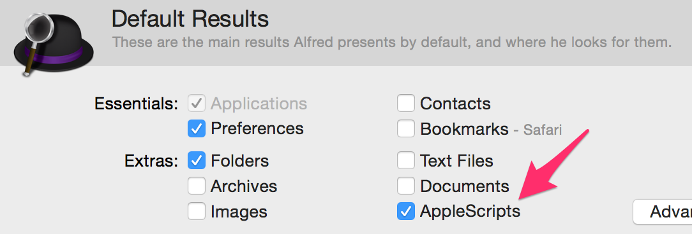

# alfred 2 で任意のRESTコマンドを実行

## TL;DR
- ```do shell script "curl 'http://xxxx/'"```というソースコードのApple Scriptを書く
- 書き出しで```app_name.app```で出力、```/Applications/```に移動
- alfred 2 で ```app_name``` と入力することで呼び出せる

## 追伸
- 別にappへ書きださなくても以下の様な設定にするだけで書類などに保存されているAppleScriptが実行できるみたいだ。
  - 
  - Default Result > Extras > AppleScriptのチェックを有効に

## 参考文献
- [Applescript + REST? - StackOverFlow](http://stackoverflow.com/questions/5998789/applescript-rest)

----

_eof_
