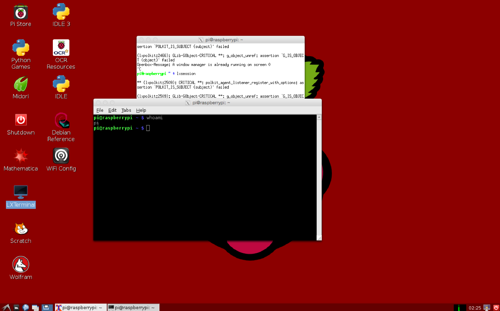
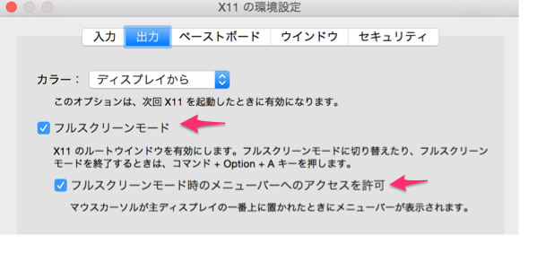
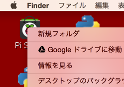
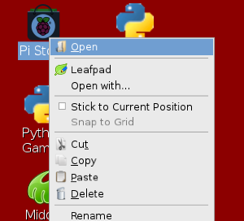

# リモートのRaspberry PiをローカルPCっぽく使う

## やったこと
- 以下の記事を見かけて感動。記事に書いてることをやってみた
  - [Mac のディスプレイに Raspberry Pi のデスクトップを表示する](http://qiita.com/UedaTakeyuki/items/7cc0fc6011cb0448c070)
- ```brew cask install xquartz``` で XQuartzを入れる
- ランチャー > その他 > XQuartz でターミナル起動  
  
- 以下コマンドでRaspberry Pi に接続
```sh
ssh -X pi@192.168.x.x lxsession
```
- デスクトップが起き上がってくる  



## Raspberry Pi上のデスクトップを操作するために
- フルスクリーンモードとフルスクリーン時のメニューバーアクセス許可を有効にする  

- フルスクリーン設定before/afterでアイコンを右クリックした時の違い
  - before  
    
  - after  
    

## 感想
- クリップボードが Macと同一
- ウィンドウの移動がなど描画がローカルのようにヌルヌル動く。
  - VNCのように画像転送しているわけじゃなそう？
  - ネットワークトラフィックもVNCより軽そう？
- 操作レスポンスがかなり良いため、ファイルマネージャは直接Raspberry Piをいじってるような感じ
- プリインストールのpython_gamesはリモート操作のようにカクカク
- Scratchは起動しても、動作せずにCPU100%に張り付く
- フルスクリーンをオフにするとMacとRaspberry Piのハイブリッドなデスクトップになる。
  - デスクトップのアイコンはクリック出来ない(Mac側のFinderを操作してしまう)が、タスクバーのファイルマネージャのアイコンからデスクトップにたどれば代用可能。

## 結論
- Raspberry Pi上の基本GUIで作業する場合にかなり役立ちそう


## 記事の通りできなかったメモ
- 自分のMac標準ターミナルではできず、XQuartz のターミナルから```ssh -X```と```lxsession```を入力するとできた
- Raspberry Piが電源ONで自動的にデスクトップまで起動する場合、```lxsession``` は1つしか無理だよ、と怒られる
  - ```raspi-config```でconsole 起動するように設定する


## 参考文献
- [Mac のディスプレイに Raspberry Pi のデスクトップを表示する - Qiita](http://qiita.com/UedaTakeyuki/items/7cc0fc6011cb0448c070)
- [How to disable desktop GUI on Raspberry Pi](http://ask.xmodulo.com/disable-desktop-gui-raspberry-pi.html)

----

_eof_
